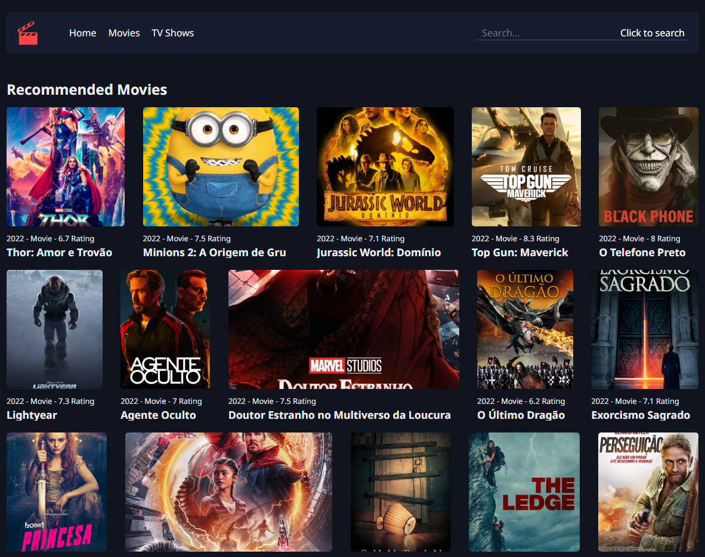

<p align="center">
    
</p>

<br />

---
## Description

This project was made with the intention of learning Vue.js and how Vuex works.
It fetchs information from [TMDB (The Movie Database)](https://www.themoviedb.org) API.

I still plan to update this application with a few features like language localization and routing.

---

## Technologies

- [Vue.js](https://vuejs.org)
- [Sass](https://sass-lang.com/)

---

## Running the Project Locally
- Clone: 
```bash
git clone https://github.com/rafael-orige/movies-gallery
```

- Install: 
```bash
yarn install
# or
npm install
```

- Initialize server: 
```bash
yarn serve
# or
npm run serve
```